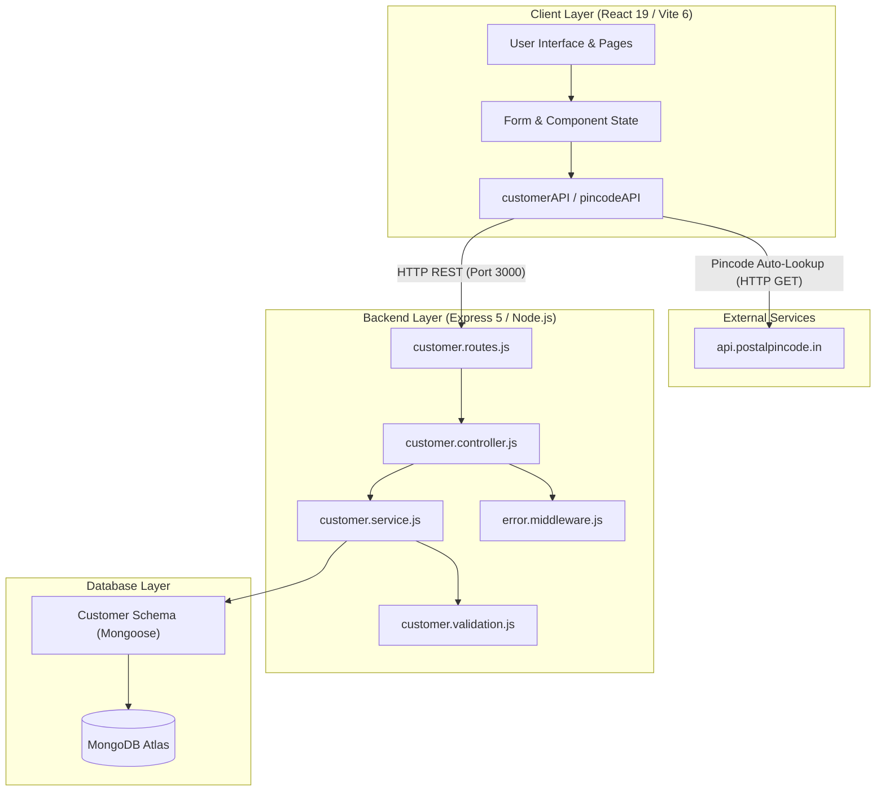
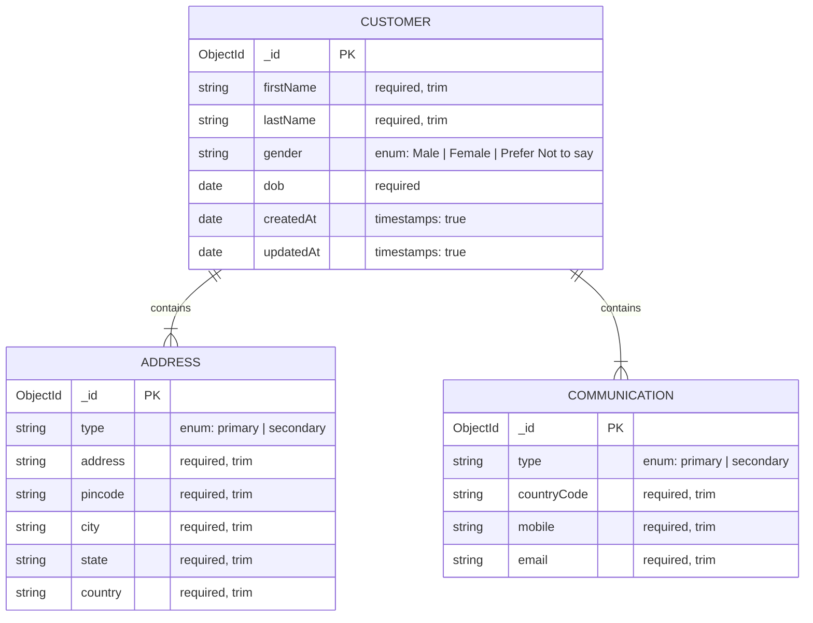
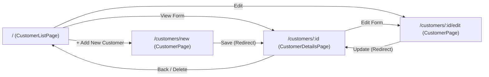
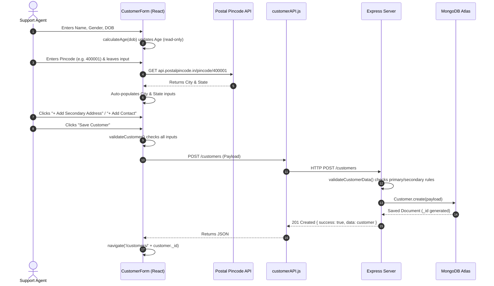
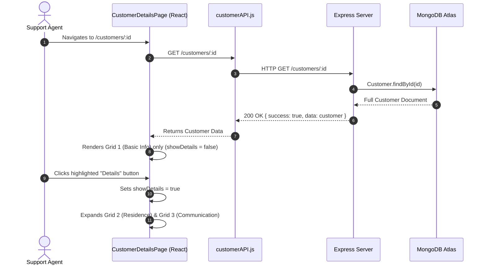

# Customer Care CRUD — Architecture & System Design Report

This document contains the complete technical architecture, data models, component breakdowns, and operational workflows for the **Customer Care CRUD** application.

---

## 1. Executive Summary & System Overview

The **Customer Care Management System** is a fullstack web application built on the **MERN** stack (MongoDB, Express.js, React, Node.js). It is tailored for customer support environments where agents need to maintain customer identity profiles, multiple categorized residences, and multiple communication touchpoints.

### Core Technology Stack

| Layer | Technology | Key Libraries & Specifications |
| :--- | :--- | :--- |
| **Frontend** | React 19 + Vite 6 | React Router DOM v7, Vanilla CSS3 (Custom Design Tokens) |
| **Backend** | Node.js (ES Modules) + Express 5.2 | Mongoose 9.10, CORS, Dotenv |
| **Database** | MongoDB Atlas | Replica Set Cloud Database |
| **External APIs** | Postal Pincode API | `https://api.postalpincode.in` (Indian Postal Directory) |

---

## 2. High-Level System Architecture

The application implements a decoupled client-server architecture communicating over a RESTful HTTP JSON API.



---

## 3. Backend Deep Dive (`/backend`)

The backend is organized according to the **Layered Architecture pattern** (`Router -> Controller -> Service -> Model -> Database`), cleanly separating routing, business logic, validation, and persistence.

```
backend/
├── src/
│   ├── app.js                   # Express application setup & middleware stack
│   ├── server.js                # Server entry point & DB connection bootstrapper
│   ├── config/
│   │   └── db.js                # MongoDB connection lifecycle manager
│   ├── routes/
│   │   └── customer.routes.js   # HTTP route definitions
│   ├── controller/
│   │   └── customer.controller.js # Request parsing & HTTP response formatting
│   ├── service/
│   │   └── customer.service.js  # Core business logic & database queries
│   ├── modals/
│   │   └── customer.schema.js   # Mongoose schemas & validation rules
│   ├── utils/
│   │   └── customer.validation.js # Domain-level primary/secondary rule checks
│   └── middleware/
│       └── error.middleware.js  # Global centralized error handler
└── .env                         # Environment variables (PORT, MONGO_URI)
```

---

### 3.1. Database Schema & Data Modeling

Defined in `src/modals/customer.schema.js`, the data model uses **Embedded Subdocument Arrays** for addresses and communications. This guarantees that customer identity, residence addresses, and contact points are fetched and updated atomically in a single query.



#### Structural Invariants & Domain Rules:
1. **Quantity Constraints**: Mongoose array validators enforce `addresses.length >= 1` and `communications.length >= 1`.
2. **Cardinality Rules (`customer.validation.js`)**:
   - `primaryAddresses.length === 1`: Customer must have **exactly one primary address**.
   - `primaryCommunications.length === 1`: Customer must have **exactly one primary communication**.
3. **Immutability of Primary Entities**: In `customer.service.js`, subdocuments with `type === 'primary'` are blocked from atomic deletion via `deleteSecondaryAddress` and `deleteSecondaryCommunication`.

---

### 3.2. REST API Specifications

| Method | Endpoint | Description | Request Body | Success Response |
| :--- | :--- | :--- | :--- | :--- |
| `GET` | `/customers` | Retrieve customer directory | None | `200 OK` with `[{ _id, firstName, lastName }]` |
| `POST` | `/customers` | Register a new customer | Customer JSON object | `201 Created` with full saved document |
| `GET` | `/customers/:id` | Retrieve full customer profile | None | `200 OK` (or `404 Not Found` if missing) |
| `PUT` | `/customers/:id` | Update customer record | Full/Partial JSON object | `200 OK` with updated document |
| `DELETE` | `/customers/:id` | Delete customer permanently | None | `200 OK` |
| `DELETE` | `/customers/:id/addresses/:addressId` | Delete a secondary address | None | `200 OK` (Fails if primary) |
| `DELETE` | `/customers/:id/communications/:commId` | Delete a secondary contact | None | `200 OK` (Fails if primary) |

---

## 4. Client Deep Dive (`/client`)

The frontend is built using **React 19** with **Vite 6** and **React Router DOM v7**.

```
client/src/
├── main.jsx                   # React root mounting
├── App.jsx                    # Client route definitions
├── index.css                  # CSS custom properties (tokens), resets, base typography
├── App.css                    # Component styles (cards, tables, badges, modals, animations)
├── pages/
│   ├── CustomerListPage.jsx   # Screen 1: Customer Directory table
│   ├── CustomerPage.jsx       # Wrapper page for CustomerForm
│   └── CustomerDetailsPage.jsx# Screen 2: Submitted formal application view
├── components/
│   ├── DeleteConfirmModal.jsx # Accessible delete confirmation popup modal
│   └── CustomerForm/
│       ├── CustomerForm.jsx   # Master form orchestrator (Create & Edit modes)
│       ├── BasicInformation.jsx   # Grid 1: Basic info inputs + calculated age
│       ├── AddressSection.jsx     # Grid 2: Address container + Add button
│       ├── AddressCard.jsx        # Grid 2: Individual address card (+ Pincode lookup)
│       ├── CommunicationSection.jsx # Grid 3: Communication container + Add button
│       └── CommunicationCard.jsx  # Grid 3: Individual communication card
├── services/
│   ├── customerAPI.js         # Fetch client for Backend API endpoints
│   └── pincodeAPI.js          # Fetch client for Indian Postal Pincode API
└── utils/
    ├── calculateAge.js        # Safe DOB-to-Age calculation logic
    ├── customerValidation.js  # Client-side input validation engine
    └── emailValidation.js     # RFC 5322-compliant regex email validator
```

---

### 4.1. Routing & User Flow



---

### 4.2. Key Screen Features

#### Screen 1: Customer Directory (`CustomerListPage.jsx`)
* Route: `/`
* Displays only **`firstName`** and **`lastName`** as requested.
* Real-time search filtering by full name.
* Actions per row:
  * **View Form**: Navigates to `/customers/:id`.
  * **Edit**: Navigates to `/customers/:id/edit`.
  * **Delete**: Opens the Delete Confirmation Popup Modal.

#### Screen 2: Customer Care Form (`CustomerForm.jsx`)
* Routes: `/customers/new` (Create Mode) & `/customers/:id/edit` (Edit Mode).
* **Grid 1 (Basic Information)**:
  * First Name, Last Name, Gender, Date of Birth.
  * Age auto-calculates dynamically from Date of Birth.
* **Grid 2 (Customer Residence Information)**:
  * Initialized with **1 Primary Address** by default.
  * 6-digit Pincode field auto-fetches **City** and **State** from Indian Postal API on blur.
  * Dynamic **"+ Add Secondary Address"** button; **"− Remove"** deletes secondary items only.
* **Grid 3 (Customer Communication Information)**:
  * Initialized with **1 Primary Communication** by default (+91 country code, mobile, email).
  * Dynamic **"+ Add Secondary Contact"** button; **"− Remove"** deletes secondary contacts only.
* Form validation with inline red error messages.
* Automatic redirection to `/customers/:id` upon successful save or update.

#### Screen 3: Submitted Application Details (`CustomerDetailsPage.jsx`)
* Route: `/customers/:id`
* Designed as an official submitted customer care application paper card.
* **Selective Disclosure Feature ("The Details Catch")**:
  * **Grid 1 (Basic Info)** is **visible immediately** at the top.
  * **"Details" Highlight Button**: Positioned directly below Grid 1.
  * Grids 2 & 3 (Residence and Communication) are **hidden by default**.
  * Clicking **"Details"** smoothly expands and reveals Grids 2 & 3 with primary/secondary badges and clickable `tel:` and `mailto:` action links.
* Actions: **"Edit Form"** and **"Delete Customer"**.

#### Screen 4: Reusable Delete Confirmation Modal (`DeleteConfirmModal.jsx`)
* Replaces browser alerts with an accessible, styled modal dialog.
* Features backdrop blur, warning icon, customer name, and explicit warning message.
* Supports dismissal via the **Escape** key or backdrop click.
* Includes a loading state (*"Deleting Permanently..."*) to prevent duplicate submissions.

---

## 5. End-to-End Sequence Workflows

### 5.1. Customer Creation Flow



---

### 5.2. View & Expand Details Flow



---

## 6. Resilience, Compatibility & Bug Fixes

1. **Legacy Database Normalization (`countrycode` vs `countryCode`)**:
   - Both the frontend form, validation, and details display now use fallback chaining:
     ```javascript
     countryCode: comm.countryCode || comm.countrycode || "+91"
     ```
2. **Safe String Trimming**:
   - All validation methods guard against `undefined` or `null` attributes with `(value || "").trim()`, preventing `TypeError: Cannot read properties of undefined (reading 'trim')`.
3. **Mongoose 9 Deprecation Migration**:
   - Replaced deprecated `new: true` with `{ returnDocument: "after", runValidators: true }` in `customer.service.js`.
4. **Invalid Date Protection**:
   - In `calculateAge.js`, invalid date inputs (`NaN`) and future dates return `0` or empty strings rather than crashing the component tree.
5. **Accurate HTTP Status Codes**:
   - In `customer.controller.js`, missing records return HTTP `404 Not Found` (replacing the previous HTTP 200 `{ success: false }` pattern).

---

## 7. How to Run Locally

### Start Backend:
```bash
cd backend
npm run dev
```
*Server runs on: `http://localhost:3000`*

### Start Client:
```bash
cd client
npm run dev
```
*Application runs on: `http://localhost:5173`*
